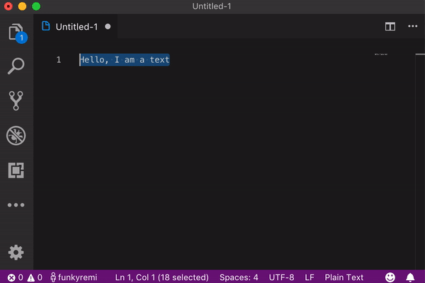

# Vscode Google Translate

[](https://github.com/funkyremi/vscode-google-translate)
 

Quickly translate text right in your code 🚀



## Usage

### Translate selected text

1. Select some text to translate
1. Press `ALT+SHIFT+T`
1. Select the output languages you want and enjoy 👍

### Translate a line under cursor

This feature inserts a newline under the current one with translation

1. Set cursor/cursors on line(s) to translate
1. Select menu 'Translate line(s) under the cursor'
1. Select the output languages you want and enjoy

## Preferred language settings

Want to quickly translate into a specific language?
Run Command 'Set Preferred Language' or Set it in VSCode extension settings

## Tooltip Hover Translation

By default when you hover over comments and code, you will get a translation into
your preferred language hovering above the element. If you want to turn this off
go into extension settings and un-check HoverTranslations then restart VSCode.

## Proxy Support

You can use a proxy to translate text with the following settings:

```js
"vscodeGoogleTranslate.host": "120.0.0.1"       // Proxy disabled if empty
"vscodeGoogleTranslate.port": "8080"            // Proxy port
"vscodeGoogleTranslate.username": "admin"       // Proxy auth disabled if empty
"vscodeGoogleTranslate.password": "password"    // Proxy password
```

## Pull request

Pull request are welcome. Fork the project, clone it, install dependencies `npm i` and start coding :-).

If you want to make changes to the code hovering translations. Please run "npm run compile" from the root in order to compile the typescript
part of the codebase.

Many thanks to the people who participate for making it awesome!
## Show your support

**Give five stars 🤩**

If you like it, [rate it](https://marketplace.visualstudio.com/items?itemName=funkyremi.vscode-google-translate&ssr=false#review-details)
